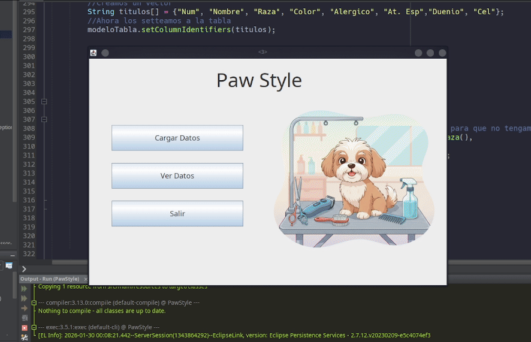

# 🐾 PawStyle - Dog Grooming Management System

**PawStyle** is a robust desktop application designed for managing records in a dog grooming business. The system implements a multi-layer architecture to ensure efficient and persistent handling of pet and owner information.

---

## 🎬 Project Demo

This section demonstrates the application's functionality, from pet registration to the management table visualization.



---

## 🚀 Technologies Used

The project was developed using a modern technology stack, leveraging **Java 21** capabilities and professional-grade management tools:

* **Language:** Java 21 (JDK 21).
* **Dependency Manager:** Maven (for build automation and library management).
* **Persistence:** JPA (Java Persistence API) with Hibernate/EclipseLink.
* **Database:** MySQL (managed via XAMPP).
* **Graphical User Interface (GUI):** Java Swing (designed with NetBeans GUI Builder).
* **Operating System:** Developed entirely in a Linux environment (Kubuntu).

---

## 🛠️ Installation and Configuration

To set up this project in your local environment, follow these steps:

### 1. Prerequisites
* **Java 21** installed.
* **Maven** installed and configured in your PATH.
* An active **MySQL** server (XAMPP recommended).

### 2. Database Configuration
1. Start the MySQL module in XAMPP.
2. Create a database named `paw_style`.
3. The system is configured to generate tables automatically upon the first execution using the `javax.persistence.schema-generation.database.action` property set to `create`.

### 3. Compilation and Execution
From your system terminal (Kubuntu/Linux):
```bash
# Clean and compile the project
mvn clean compile

# Run the application
mvn exec:java -Dexec.mainClass="com.mycompany.pawstyle.PawStyle"
```

---

## 👤 Autor

<table border="0">
  <tr>
    <td width="150">
      
    </td>
    <td>
      <strong>Juan Turriago</strong><br>
      🚀 Estudiante de Ingeniería de Sistemas - <em>Politécnico Grancolombiano</em><br>
      💻 Programador Java | Entusiasta de Linux<br>
      📫 <b>Contacto:</b> Puedes encontrarme en mi perfil de GitHub para futuras colaboraciones.
    </td>
  </tr>
</table>

---
*This project was carried out for academic purposes for professional training in software development (2026).*
